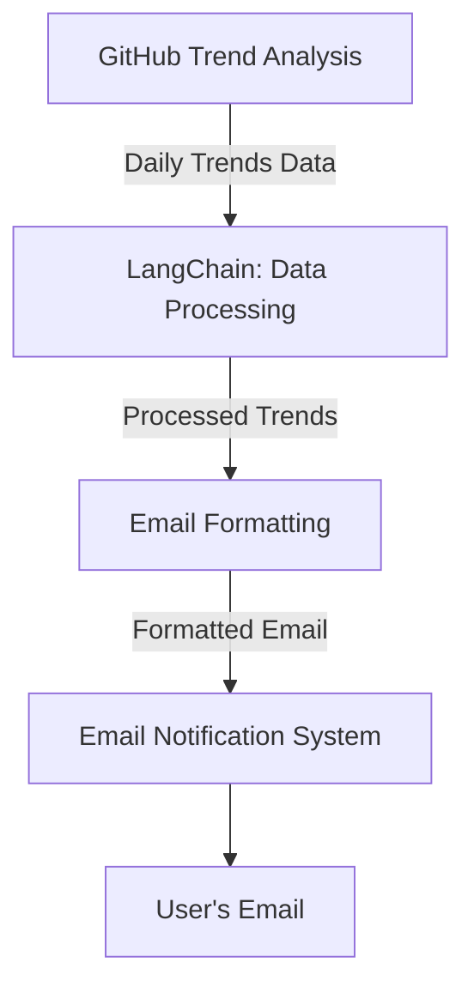

# trendy

## Goal

To analyse the most interesting repos from gh trends and send them to the user's email.
Why? Because that's the best way to keep up with the latest trends in the tech world.

```mermaid
graph TD;
    A[GitHub Trend Analysis] -->|Daily Trends Data| B[LangChain: Data Processing]
    B -->|Processed Trends| C[Email Formatting]
    C -->|Formatted Email| D[Email Notification System]
    D --> E[User's Email]
```